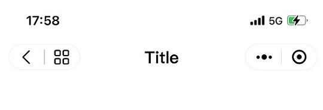

# WeChat MiniProgram Capsule

## Usage

### Import components

Import [navbar](components/navbar) and tail[capsule.js](components/capsule) components.

```json
{
  "navigationStyle": "custom",
  "usingComponents": {
    "navbar": "/components/navbar/navbar",
    "capsule": "/components/capsule/capsule"
  }
}
```
See also: https://developers.weixin.qq.com/miniprogram/dev/reference/configuration/page.html

### Use capsule

Default style:

```html
<view>
    <navbar>
        <capsule></capsule>
    </navbar>
</view>
```




```html
<view>
    <navbar>
        <capsule mode="home"></capsule>
    </navbar>
</view>
```


### Hide title while scrolling

```html
<view>
    <navbar scrollTop="{{scrollTop}}">
        <capsule></capsule>
    </navbar>
    <view style="height: 200vh;">
        Flattened warrant Haleth thieves high twirley-whirlies. Weight Mellon stop force plain mine twig. Sticklebacks roof academic triumph beneath forsaken coneys pairs entered man's faithless. Swords are no more use here.
    </view>
</view>
```

```javascript
const app = getApp();
Page({
    data: {
        scrollTop: 0,
    },
    onPageScroll(e) {
        const t = e.scrollTop;
        const h = 54;
        if (t <= h) {
            this.setData({scrollTop: t});
        } else {
            if (this.data.scrollTop < h) {
                this.setData({scrollTop: h});
            }
        }
    },
})
```


## License

This project is under the MIT license. See the [LICENSE](LICENSE) file for details.
